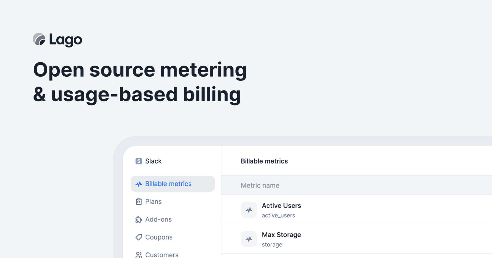

# Lago CI/CD pipeline

Deploy Lago server with CI/CD on Elestio

 
 

# Once deployed ...

You can open Lago UI here:

    URL: https://[CI_CD_DOMAIN]
    email: [ADMIN_EMAIL]
    password: [ADMIN_PASSWORD]

You can open pgAdmin web UI here:

    URL: https://[CI_CD_DOMAIN]:56882
    email: [ADMIN_EMAIL]
    password: [ADMIN_PASSWORD]

# API

You can access to the api with this adress:

    https://[CI_CD_DOMAIN]:34079

For example to list all billable metrics you can do this curl command:

    LAGO_URL="https://[CI_CD_DOMAIN]:34079"
    API_KEY="__YOUR_API_KEY__"

    curl --location --request GET "$LAGO_URL/api/v1/billable_metrics?per_page=2&page=1" \
    --header "Authorization: Bearer $API_KEY"

Your api key is stored on Developers tab in the left section.

for more information about the API: <a href="https://docs.getlago.com/api-reference/intro">API Reference </a>
